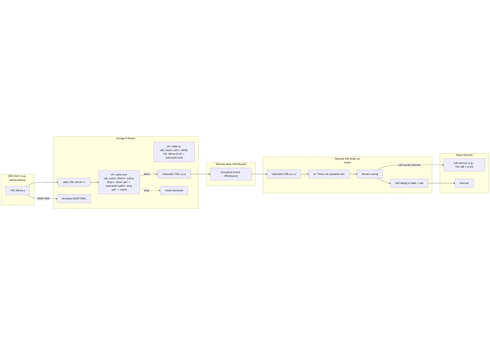
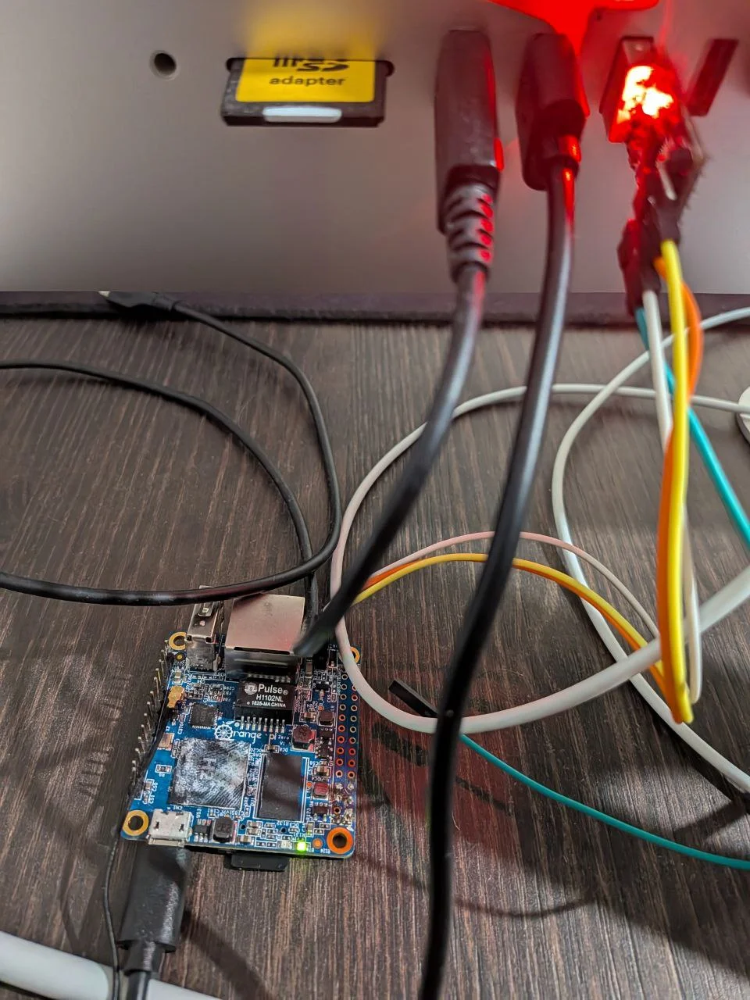
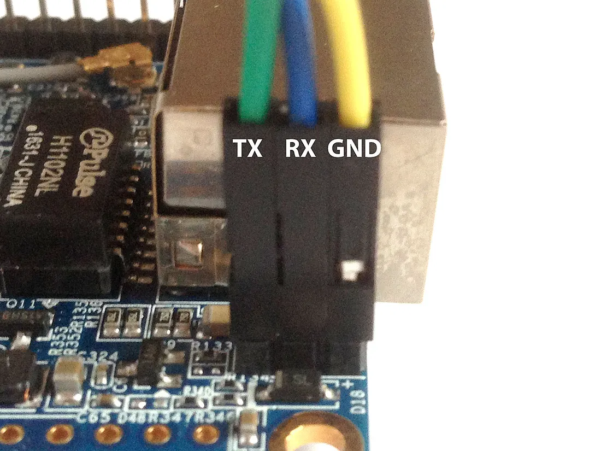
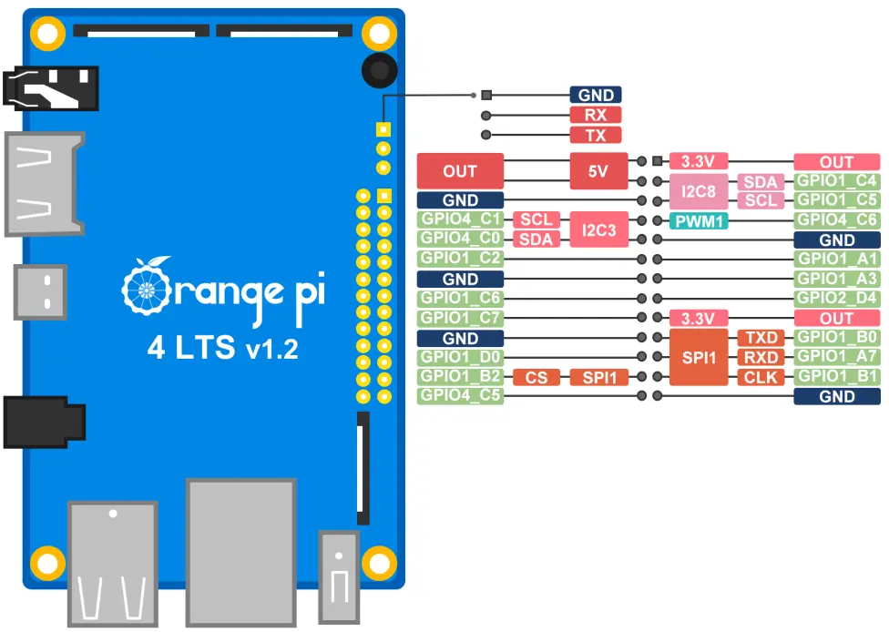

# USB VPN Router



## **Who it’s for (ICP) and core value**

- **ICP**: Digital nomads, founders, traders, streamers, journalists, ad buyers, QA teams, remote employees needing “home-like” IP.
- **Primary value**:
    - Zero setup: plug via USB; macOS/Windows/Linux see it as a wired adapter (virtual Ethernet).
    - Residential IP egress: your traffic exits from a stable residential/home IP (your own node or managed pool).
    - Local network: connect multiple devices to the box; all share the same residential IP.
    - Deterministic networking: bypass flaky per‑device VPN configs; consistent routing rules at the box.

## **Key use cases**

- **“Home IP on the go”**: banking portals, corporate allowlists, SaaS geofencing, ad platforms.
- **Streaming reliability**: residential IP reduces blocks vs datacenter IPs.
- **Testing/QA**/ad verification__: consistent geo, repeatable results.
- **Journalists/field teams**: consistent, safer egress with simple plug‑in.

## **Differentiation**

- **True plug‑and‑play**: USB NIC shows up instantly; no per‑device VPN.
- **Residential IP first**: compliant sourcing; predictable allowlisting.
- **Multi-device**: USB host + optional local Wi‑Fi/LAN behind NAT.
- **Minimalism**: no app install, no OS drivers, no captive portal per device.

## Quick Start

```bash
# Clone the repository
git clone https://github.com/yourusername/usb-vpn-router.git
cd usb-vpn-router
./setup-usb-router.sh
```

## How It Works

1. **USB Gadget Mode**: Creates a USB ethernet interface (`usb0`)
2. **DHCP Server**: Assigns IPs to connected devices (192.168.64.50-150)
3. **Policy Routing**: USB traffic goes through VPN, device keeps local access
4. **Failover Monitor**: Switches between Tailscale/OpenVPN automatically
5. **Kill Switch**: Default DROP policy prevents any leaks

## Configuration


### useful commands

```bash
iw dev wlan0 link
```

### Orange Pi Zero Pinout Reference



**Connection Notes:**
- Use the micro-USB port (not the USB-A port) for gadget mode
- UART pins for console access: TX (pin 8), RX (pin 10), GND (pin 6)
- Power can be supplied through micro-USB or GPIO pins


### Orange Pi 4 LTS



## Orange Pi Zero 2w

https://www.armbian.com/orange-pi-zero-2w/


## Requirements

- Debian/Ubuntu-based OS
- USB OTG capability
- Root access
- Internet connection for initial setup

## Troubleshooting


**macOS USB Interface Not Active:**
- After connecting the USB cable and allowing the accessory, the interface may appear as "inactive"
- Manually activate it with:
  ```bash
  sudo ifconfig en8 up          # Bring the interface up
  sudo ipconfig set en8 DHCP     # Trigger DHCP client
  ```
- Replace `en8` with your actual interface name (check with `ifconfig -a`)

**macOS "Allow Accessory to Connect" prompt:**
- When first connecting, macOS shows a permission dialog
- The USB interface won't appear until you click "Allow"
- The watchdog service automatically handles this delay
- Check status: `systemctl status usb-interface-watchdog`
- View logs: `tail -f /var/log/usb-interface-watchdog.log`

**No DHCP lease:**
- Check USB cable (must be data cable, not charge-only)
- Verify g_ether module: `lsmod | grep g_ether`
- Check watchdog: `usb-interface-watchdog check`

**No internet access:**
- Check VPN status: `usb-router-status`
- Verify kill switch: `iptables -L FORWARD -n -v`
- Check logs: `journalctl -u usb-router-vpn-monitor -f`

**SSH access lost:**
- Connect via UART/console
- The script now prevents this with split routing
- Emergency fix: `tailscale set --exit-node-allow-lan-access=true`

## License

MIT License - see LICENSE file for details


## RNDIS and ECM

With ECM and RNDIS active simultaneously:

The device may expose two USB NICs (e.g., usb0 and usb1). Which becomes usb0 is not guaranteed across boots.
Your config currently pins to USB_INTERFACE="usb0":
dnsmasq binds to usb0
systemd-networkd and other flows configure usb0
nftables forward rules reference USB_INTERFACE
On Windows, the active path will be RNDIS; on macOS/Linux, ECM. If RNDIS becomes usb1, Windows clients won’t get DHCP because dnsmasq is bound to usb0.
